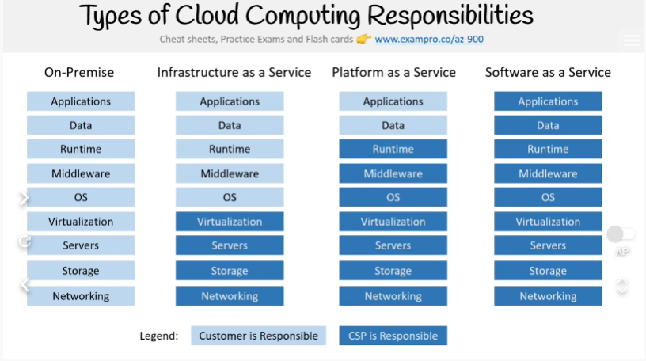

tags:: Azure, Cloud

- Computing Responsibilities
  id:: 6356f2a2-ef29-4b13-b761-d6535013cf16
	- 
- #+BEGIN_TIP
  PUBLIC CLOUD IS ALSO CALLED CLOUD NATIVE
  #+END_TIP
- Private cloud is all on company's datacenters, also known as on prem
  id:: 6356f64d-20c3-4c66-95d0-ed4c7dbf5e69
	- like [[Open Shift]] or [[Open Stack]]
- Hybrid
-
- Total Cost of Ownership
	- CapEX
		- Spending money UPFRONT on PHYSICAL INFRASTRUCTURE
			- deduct that expense from tax bill over time
			- Servers, storage, network, backup and archive, disaster recovery, datacenter, personal
			- you have to guess upfront what you plan to spend
		- license fees are obvious,
		- Unknowns are: Implimentation, Config, Training, Physical Security, hardware, it personal
		  maintenance
	- OpEx
		- the cost associated with an on-prem data center has shifted to the cost of the service provider, customer is only concerned with NON-PHYSICAL costs
			- leasing software and customization
			- training in cloud services
			- cloud support
			- compute & storage
			- **TRY WITHOUT INVESTING IN EQUIPMENT**
		- Subscription fees
		- unknowns are implementation, config, training
	- On average 75% savings when moving to the cloud
-
- Cloud Architecture Terminologies
	- HA - high availability
		- a few different machines can be split across multiple [[AZ]]s using a load balancer, azure's is called [[Azure Load Balancer]]
	- Scalability
		- ability to increase capacity based on demand
		- vertical scaling -  upgrade to bigger servers
		- horizontal - adding additional servers
	- Elasticity
		- can automatically increase or decrease based on demand
		- [[Azure VM Scale Set]], [[SQL Server Stretch Database]]
	- Fault Tolerance
	- Disaster Recovery - High Durability
		- do you have a backup?
		- how fast can you restore?
		- can you ensure current live data is not corrupt?
-
- Evolution of Compute
	- Dedicated
		- the machine is wholly utilized by a single customer
		- have control of the entire machine
	- VM's
		- can have multiple dedicated machines with specific compute compacity on one machine
		- run a guest OS on a hypervisor
	- Containers
		- can have multiple workloads running on a single machine/ VM that get their own resource pools
		- not limited by an OS
	- Functions
		- managed VM running managed containers
		- running single bits of code
		- also known as **SERVERLESS COMPUTE**
		- can suffer from cold starts, when you first launch the function, it has to provision the underlying server to start before your function runs
-
- Regions and Geographies
	- a [[Region]] is a group of multiple datacenters [[AZ]]
	- azure has 58 regions available across 140 countries
	- a [[Geography]] is a discrete market of two or more regions that preserves __data residency__ and __compliance boundaries__
		- United States
		- Azure Government (US)
		- Canada
		- Brazil
		- Mexico
	- its a guarantee that data will not lave boundaries
-
- Paired Regions
	- Each region is paired with one 300 miles away to ensure no outages
	- [[Azure Geo-redundant Storage]] replicates data to a secondary region automatically, ensuring data is durable even when the primary region isn't recoverable
	- For example: North America has East US paired with West US
-
- Region Types and Service Availability
	- Two Types of [[Region]]s
		- **Recommended region** - broadest range of resources & supports [[AZ]]
		- **Alternate region** - extends Azure's footprint within a data residency boundary where a recommended region also exists
		- labeled as "other" in the Azure portal
	- #+BEGIN_TIP
	  NOT ALL SERVICES ARE AVAILABLE IN EVERY REGION
	  #+END_TIP
	- Service Availability
		- General Availability - a service is considered ready to be used publicly by everyone
		- Three categories of availability otherwise -
			- **Foundational** - when it goes GA, it's available immediately or in 12 months in Recommended and Alternate Regions
			- **Mainstream** When GA, immediately available or in 12 in months in Recommended regions
			  may become available for Alternate regions based on demand
	- These have now changed
		- there's now
			- **General Availability**
			- **Private Preview**
			- **Public Preview**
-
- Special Regions
	- for compliance or legal reasons
	- US DoD central
	- US Gov Virginia
	- US Gov Iowa
	- *Three undisclosed US regions
	- China East and China North
		- maintained through a unique partnership with Microsoft and 21vianet 世紀互聯
-
- ((635707df-34da-4f81-b912-a01074387de8))
	- a physical location made up of one or more datacenter
	- a region generally has 3 availability zones
	- common practice to run workloads across 3 AZ's
-
- The following regions have at least 3 [[AZ]]s
	- Central US
	- East US 2
	- West US 2
	- West Europe
	- France Central
	- North Europe
	- Southeast Asia
-
- An [[AZ]] is a combo of [[Fault Domain]] and [[Update Domain]]
	- You use [[Availability Set]] to avoid these downtimes
-
- Compute Services
	- Azure Vms
	- Azure Container Instances
	- [[Azure AKS]]
	- [[Azure Service Fabric]]
	- [[Azure Functions]]
	- [[Azure Batch]]
- Storage Services
	- [[Azure Blob Storage]]
	- [[Azure Disk Storage]]
	- [[Azure File Storage]]
	- [[Azure Queue Storage]] *
	- [[Azure Table Storage]] *
	- [[Azure Data Box]]
	- [[Azure Archive Storage]]
	- [[Azure Data Lake]]
- Database Services
	- [[Azure Cosmos DB]]
	- [[Azure SQL Database]]
	- [[SQL Server on VM]]
	- [[Azure Synapse Analytics]]
	- Database Migration Service
	- [[Azure Cache for Redis]]
	- [[Azure Table Storage]]
- Application Integration Services
  id:: 6357fec7-671e-4478-98ce-d8dd4ae52354
	- [[Azure Notifications Hub]]
	- [[Azure API Apps]]
	- [[Azure Service Bus]]
	- [[Azure Stream Analytics]]
	- [[Azure Logic Apps]]
	- [[Azure API Management]]
	- [[Azure Queue Storage]]
-
- apps deployed on any of these PaaS services runs in the [[Azure App Service Plan]], and users can take advantage of predefined pricing and compute strategies
	- the following NEED to use the plan
		- [[Azure Web Apps]]
		- [[Azure API Apps]]
		- [[Azure Mobile Apps]]
	- While [[Azure Functions]] have the option of using it or not
	-
- Developer and Mobile Tools
	- [[Azure SignalR Service]]
	- [[Azure App Service]]
	- Visual Studio
	- [[Xamarin]]
- Azure DevOps Services
	- [[Azure Boards]]
	- [[Azure Pipelines]]
	- Azure Repos
	- [[Azure Test Plans]]
	- Azure Artifacts
	- [[Azure Dev Test Labs]]
- Azure Resource Manager (ARM)
	- ARM lets you programmatically create Azure resources via JSON template
- Azure QuickStart Templates are a library of pre-made ARM templates for a variety of stack scenerios
	- deploy a Django app
	- deploy an Ubuntu VM with docker engine
	- CI/CD and containerized app deploy docker enterprise & jenkines
	- webapp on linux with PostgreSQL
-
- vNets and Subnets
  collapsed:: true
	- [[Azure vNet]]
	- can choose your own IPs using CIDR
	- comparable to AWS PVC
- Cloud Native networking Services
	- [[Azure DNS]]
	- [[Azure vNet]]
	- [[Azure Load Balancer]]
	- [[Azure Application Gateway]]
	- [[Azure Network Security Groups]]
- Enterprise/ Hybrid Networking Services
	- bridges on prem to cloud
	- [[Azure Front Door]]
	- [[Azure Express Route]]
	- [[Virtual WAN]]
	- [[Azure Connection]]
	- [[Virtual Network Gateway]]
	- [[Azure Traffic Manager]]
	- [[Azure VM Scale Set]]
	- [[Azure VPN Gateway]]
	-
-
- IoT services
	- [[IoT Central]]
	- [[IoT Hub]]
	- [[IoT Edge]]
	- [[Azure Sphere]]
	- [[Windows 10 IoT core Services]]
-
- Big Data Services
	- data so large in cannot be moved and processed using traditional DB and software techniques
	- [[Azure Synapse Analytics]]
	- [[HD Insight]]
	- [[Azure Databricks]]
	- [[Data Lake Analytics]]
-
- AI/ ML Services
	- [[Azure Machine Learning Service]]
	- [[Azure Personalizer]]
	- [[Azure Translator]]
	- [[Azure Anomaly Detector]]
	- [[Azure Bot Service]]
	- [[Azure Form Recognizer]]
	- [[Azure Computer Vision]]
	- [[Azure QnA Maker]]
	- [[Azure Text Analytics]]
	- [[Azure Content Moderator]]
	- [[Azure Face]]
	- [[Azure Ink]]
-
- Serverless Services
	- event driven scale
	- abstraction of servers, code is running as functions
	- micro-billing - functions could run in a fraction of a second
	- [[Azure Functions]]
	- [[Blob Storage]]
	- [[Azure Logic Apps]]
	- [[Azure Event Grid]]
-
- Security in Azure
	- [[Azure Trust Center]]
	- [[Azure AD]]
	- [[Azure Security Center]]
	- [[Azure Key Vault]]
	- [[Azure DDoS Protection]]
	- [[Azure Firewall]]
	- [[Azure Information Protection]]
	- [[Azure Application Gateway]]
	- [[Azure Advanced Threat Protection]]
	- [[Microsoft Security Development Lifecycle]]
	- [[Azure Policy]]
	- [[Azure RBAC]]
	- [[Azure Lock]]
	- [[Azure Management Group]]
	- [[Azure Monitor]]
	- [[Azure Service Health]]
	- [[Azure Advisor]]
-
- Billing and Cost
	- [[Azure SLA]]
	- [[Azure Service Credits]]
	- [[Azure Composite SLA]]
	- [[Azure TCO Calculator]]
	- [[Azure Marketplace]]
	- [[Azure Support Plan]]
	- [[Azure Hybrid Benefit]]
	- [[Azure Subscription]]
	- [[Azure Pricing Calculator]]
	- [[Azure Cost Management]]