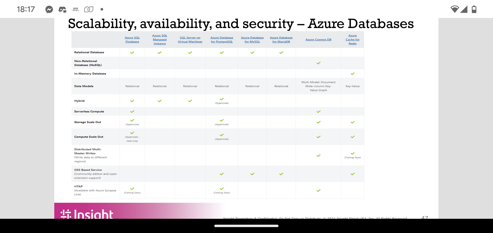

tags:: Azure, Cloud, Insight

- most important decisions when designing a cloud revolve around ((6356f2a2-ef29-4b13-b761-d6535013cf16))
	- ie, how much do you want to control yourself?
	- WHY do you want to move to the cloud?
- SaaS makes sense for
	- End Users
	- infrequent access
	- speed
- IaaS makes sense for
	- Sys admins
	- Custom set ups
	- speed
- PaaS
	- Developers
	- Create custom apps and services
	- don't have to worry about infrastructure
-
- ARM Templates [[Azure Resource Manager]]
	- because you need to manage the code AND the service at the same time (DevOps)
	-
- [[Azure Event Grid]]
-
- Lightweight code lifting
	- serverless
	- example: a user clicks save
- Workflows:
	- A request was made in a web app (save)
	- request queued to service bus
	- [[Azure Functions]] is triggered
	- Writes to [[Azure Cosmos DB]]
-
- [[Azure Functions]] are NOT good for CPU heavy or long running workflows
	- only pay for when they're used
- [[Azure Webjobs]] Are better for CPU heavy workloads
- [[Azure Logic Apps]]
- [[Azure Service Bus]]
-
- When to use specific databases
	- DONE screengrab slide 47 in Azure Apps and Data slides
	- 
	- starting with aging SQL EOL
		- 1. Modernize to azure by using PaaS by moving to SQL managed instance or move to IaaS with SQL VM
		- 2. upgrade on prem to new SQL
		- 3.Stay on prem and purchase extended security updates
- [[Azure SQL Database]]
	- great for managing structured data, indexes, constraints, etc
- [[Azure SQL Managed Instance]]
	- in-between fully managed database and a SQL server on VM
	- choose SQL managed instance if
	- you want native [[Azure vNet]] integration
	- your apps are running in Azure VM or [[Azure VM Scale Set]]
	- best for migrations allow existing SQL server customers to lift and shift their on prem apps to the cloud
- SQL server on VM
	- reduced cost of running SQL databases in the cloud
-
- Database "management by Azure" considerations
	- DONE check screen 49
- Database Deploy And design considerations
	- scaling
	- disaster recovery
	- HA
	- load balancing
	- fault tolerance
	- administration
	- cost
-
- azure storage has 5 kinds
	- blob
	- table
	- queue
	- files storage
	- disk storage
-
- [[Azure Cache for Redis]]
-
- [[Azure Backup Service]]
- [[Azure Draas]]
- [[Azure Application Gateway]]
-
- Questions:
	- ask Dhaval and architecture
-