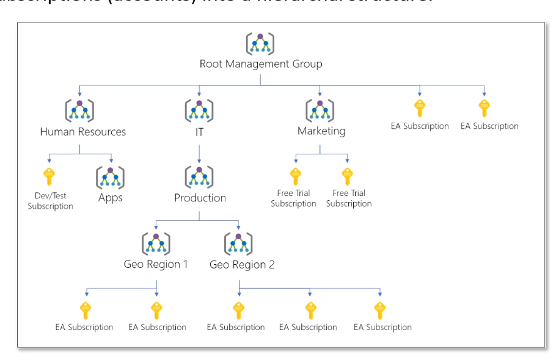

- logical separations of the main [[AAD Tenant]]
- manage multiple [[Azure Subscription]]s
-
- each directory has a single top-level management group called Root
- all subscriptions within the management group inherit the conditions applied to the [[Azure Management Group]]
- 
-