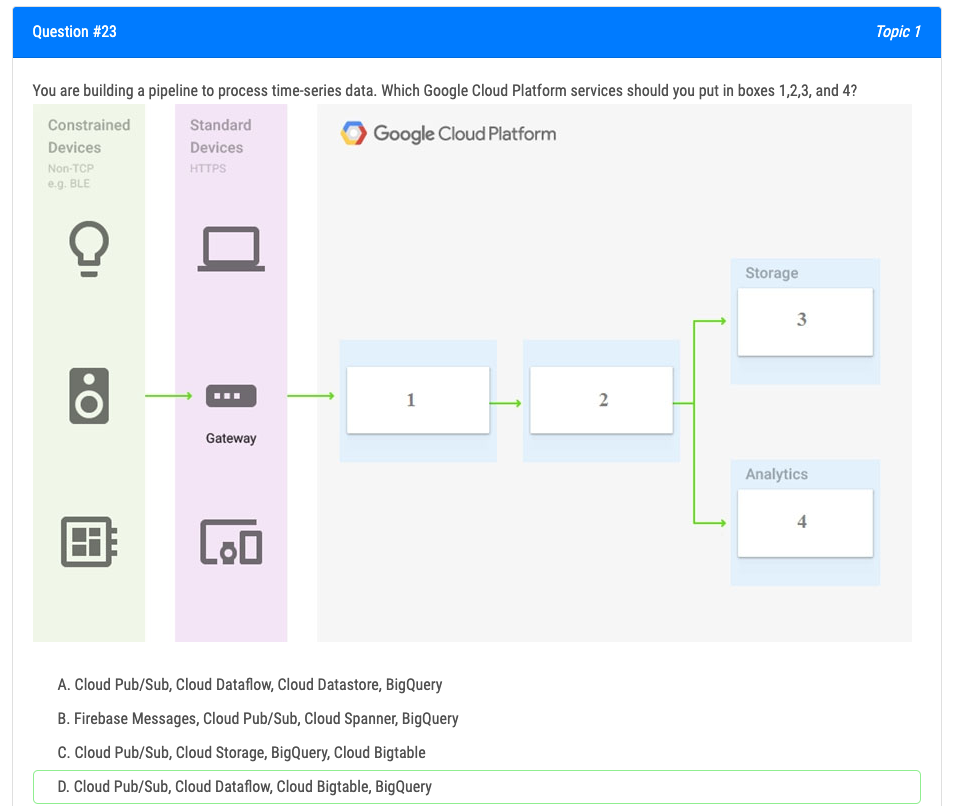

- You want to configure autohealing for network load balancing for a group of Compute Engine instances that run in multiple zones, using the fewest possible steps.
  You need to configure re-creation of VMs if they are unresponsive after 3 attempts of 10 seconds each. What should you do? [[GCP Cloud Load Balancing]]
	- A. Create an HTTP load balancer with a backend configuration that references an existing instance group. Set the health check to healthy (HTTP)
	- B. Create an HTTP load balancer with a backend configuration that references an existing instance group. Define a balancing mode and set the maximum RPS to 10.
	- C. Create a managed instance group. Set the Autohealing health check to healthy (HTTP) **Most Voted**
	- D. Create a managed instance group. Verify that the autoscaling setting is on.
	- https://cloud.google.com/compute/docs/tutorials/high-availability-autohealing
-
- You need to support point-in-time recovery on [[GCP Cloud SQL]]
	- https://cloud.google.com/sql/docs/postgres/backup-recovery/pitr
-
- Look up more about shared projects or sub projects
-
- You are deploying an application to App Engine. You want the number of instances to scale based on request rate. You need at least 3 unoccupied instances at all times. Which scaling type should you use? [[GCP App Engine]]
	- D. Automatic Scaling with min_idle_instances set to 3.
-
- You have a development project with appropriate IAM roles defined. You are creating a production project and want to have the same IAM roles on the new project, using the fewest possible steps. What should you do?
- copy IAM roles
	- https://cloud.google.com/sdk/gcloud/reference/iam/roles/copy
-
- [[GCP Deployment Manager]] vs [[GCP Managed Instance Group]]
-
- You created an instance of SQL Server 2017 on Compute Engine to test features in the new version. You want to connect to this instance using the fewest number of steps. What should you do?
	- B. Install a RDP client in your desktop. Set a Windows username and password in the GCP Console. Use the credentials to log in to the instance.
-
- 
	- [[GCP Bigtable]] is best use case here, because it has real time app services, also great for large data analytics workloads
	- if its data streams, think Bigtable
-
- You have a project for your App Engine application that serves a development environment. The required testing has succeeded and you want to create a new project to serve as your production environment. What should you do?
- A. Use gcloud to create the new project, and then deploy your application to the new project.
- You can deploy to a different project by using –project flag.
  By default, the service is deployed the current project configured via:
  $ gcloud config set core/project PROJECT
  To override this value for a single deployment, use the –project flag:
  $ gcloud app deploy ~/my_app/app.yaml –project=PROJECT
-
- You need to set up permissions for a set of Compute Engine instances to enable them to write data into a particular Cloud Storage bucket. You want to follow
  Google-recommended practices. What should you do?
- A. Create a service account with an access scope. Use the access scope 'https://www.googleapis.com/auth/devstorage.write_only'.
- B. Create a service account with an access scope. Use the access scope 'https://www.googleapis.com/auth/cloud-platform'.
- C. Create a service account and add it to the IAM role 'storage.objectCreator' for that bucket. **Most Voted**
- D. Create a service account and add it to the IAM role 'storage.objectAdmin' for that bucket.
-
- You have sensitive data stored in three Cloud Storage buckets and have enabled data access logging. You want to verify activities for a particular user for these buckets, using the fewest possible steps. You need to verify the addition of metadata labels and which files have been viewed from those buckets. What should you do?
- A. Using the GCP Console, filter the Activity log to view the information. **Most Voted**
- B. Using the GCP Console, filter the Stackdriver log to view the information. **Most Voted**
- C. View the bucket in the Storage section of the GCP Console.
- D. Create a trace in Stackdriver to view the information.
-
- You have an object in a Cloud Storage bucket that you want to share with an external company. The object contains sensitive data. You want access to the content to be removed after four hours. The external company does not have a Google account to which you can grant specific user-based access privileges. You want to use the most secure method that requires the fewest steps. What should you do?
- A. Create a signed URL with a four-hour expiration and share the URL with the company. **Most Voted**
- Signed URLs are used to give time-limited resource access to anyone in possession of the URL, regardless of whether they have a Google account.
  https://cloud.google.com/storage/docs/access-control/signed-urls
- 
- This question seems to be asking "Can you automatically enable the API or do you have to do it manually?" and I think the answer is that there's no automatic enablement of the API.
-
- You need to monitor resources that are distributed over different projects in Google Cloud Platform. You want to consolidate reporting under the same Stackdriver
  Monitoring dashboard. What should you do?
- A. Use Shared VPC to connect all projects, and link Stackdriver to one of the projects.
- B. For each project, create a Stackdriver account. In each project, create a service account for that project and grant it the role of Stackdriver Account Editor in all other projects.
- C. Configure a single Stackdriver account, and link all projects to the same account. **Most Voted**
- D. Configure a single Stackdriver account for one of the projects. In Stackdriver, create a Group and add the other project names as criteria for that Group.
- https://cloud.google.com/monitoring/settings/multiple-projects
-
- You can have service accounts in one project access resources in other projects
- https://gtseres.medium.com/using-service-accounts-across-projects-in-gcp-cf9473fef8f0
- You create the service account in proj-sa and take note of the service account email, then you go to proj-vm in IAM > ADD and add the service account's email as new member and give it the Compute Storage Admin role.
-
- You created a Google Cloud Platform project with an App Engine application inside the project. You initially configured the application to be served from the us- central region. Now you want the application to be served from the asia-northeast1 region. What should you do?
- A. Change the default region property setting in the existing GCP project to asia-northeast1.
- B. Change the region property setting in the existing App Engine application from us-central to asia-northeast1.
- C. Create a second App Engine application in the existing GCP project and specify asia-northeast1 as the region to serve your application.
- D. Create a new GCP project and create an App Engine application inside this new project. Specify asia-northeast1 as the region to serve your application. **Most Voted**
- Each Cloud project can contain only a single App Engine application, and once created you cannot change the location of your App Engine application. [[GCP App Engine]]
-
- u need to grant access for three users so that they can **view and edit** table data on a Cloud Spanner instance. What should you do?
- A. Run gcloud iam roles describe roles/spanner.databaseUser. Add the users to the role.
- B. Run gcloud iam roles describe roles/spanner.databaseUser. Add the users to a new group. Add the group to the role. **Most Voted**
- C. Run gcloud iam roles describe roles/spanner.viewer - -project my-project. Add the users to the role.
- D. Run gcloud iam roles describe roles/spanner.viewer - -project my-project. Add the users to a new group. Add the group to the role.
-
- You have an instance group that you want to load balance. You want the load balancer to terminate the client SSL session. The instance group is used to serve a public web application over HTTPS. You want to follow Google-recommended practices. What should you do?
- A. Configure an HTTP(S) load balancer. **CORRECT**
- B. Configure an internal TCP load balancer.
- C. Configure an external SSL proxy load balancer.
- D. Configure an external TCP proxy load balancer.
- According to the documentation of SSL Proxy Load Balacing on Google, "SSL Proxy Load Balancing is intended for non-HTTP(S) traffic. For HTTP(S) traffic, we recommend that you use HTTP(S) Load Balancing." in my opinion A should be the most suitable choice.
-
- You have 32 GB of data in a single file that you need to upload to a Nearline Storage bucket. The WAN connection you are using is rated at 1 Gbps, and you are the only one on the connection. You want to use as much of the rated 1 Gbps as possible to transfer the file rapidly. How should you upload the file?
- A. Use the GCP Console to transfer the file instead of gsutil.
- B. Enable parallel composite uploads using gsutil on the file transfer. **Most Voted**
- C. Decrease the TCP window size on the machine initiating the transfer.
- D. Change the storage class of the bucket from Nearline to Multi-Regional.
- see ((639a380c-0d5d-44f3-b0cb-4d1fee3af237))
-
- You want to configure 10 Compute Engine instances for availability when maintenance occurs. Your requirements state that these instances should attempt to automatically restart if they crash. Also, the instances should be highly available including during system maintenance. What should you do?
- A. Create an instance template for the instances. Set the 'Automatic Restart' to on. Set the 'On-host maintenance' to Migrate VM instance. Add the instance template to an instance group. **Most Voted**
- B. Create an instance template for the instances. Set 'Automatic Restart' to off. Set 'On-host maintenance' to Terminate VM instances. Add the instance template to an instance group.
- C. Create an instance group for the instances. Set the 'Autohealing' health check to healthy (HTTP).
- D. Create an instance group for the instance. Verify that the 'Advanced creation options' setting for 'do not retry machine creation' is set to off.
- For the exam, make sure you select the solution that has ALL of the requirements, even if you don't know what all of them do
-
- You host a static website on Cloud Storage. Recently, you began to include links to PDF files on this site. Currently, when users click on the links to these PDF files, their browsers prompt them to save the file onto their local system. Instead, you want the clicked PDF files to be displayed within the browser window directly, without prompting the user to save the file locally. What should you do?
- A. Enable Cloud CDN on the website frontend.
- B. Enable 'Share publicly' on the PDF file objects.
- C. Set Content-Type metadata to application/pdf on the PDF file objects. **CORRECT**
- D. Add a label to the storage bucket with a key of Content-Type and value of application/pdf.
-
- You need to create an autoscaling managed instance group for an HTTPS web application. You want to make sure that unhealthy VMs are recreated. What should you do?
- A. Create a health check on port 443 and use that when creating the Managed Instance Group. **Most Voted**
- B. Select Multi-Zone instead of Single-Zone when creating the Managed Instance Group.
- C. In the Instance Template, add the label 'health-check'.
- D. In the Instance Template, add a startup script that sends a heartbeat to the metadata server.
-
- Your company has a Google Cloud Platform project that uses BigQuery for data warehousing. Your data science team changes frequently and has few members.
  You need to allow members of this team to perform queries. You want to follow Google-recommended practices. What should you do?
- A. 1. Create an IAM entry for each data scientist's user account. 2. Assign the BigQuery jobUser role to the group.
- B. 1. Create an IAM entry for each data scientist's user account. 2. Assign the BigQuery dataViewer user role to the group.
- C. 1. Create a dedicated Google group in Cloud Identity. 2. Add each data scientist's user account to the group. 3. Assign the BigQuery jobUser role to the group. **Most Voted**
- D. 1. Create a dedicated Google group in Cloud Identity. 2. Add each data scientist's user account to the group. 3. Assign the BigQuery dataViewer user role to the group.
-
- multiple regions can exist inside a VPC and you don't need any special routing config
-
- You are the organization and billing administrator for your company. The engineering team has the Project Creator role on the organization. You do not want the engineering team to be able to link projects to the billing account. Only the finance team should be able to link a project to a billing account, but they should not be able to make any other changes to projects. What should you do?
- A. Assign the finance team only the Billing Account User role on the billing account. **Most Voted**
- B. Assign the engineering team only the Billing Account User role on the billing account.
- C. Assign the finance team the Billing Account User role on the billing account and the Project Billing Manager role on the organization. **Most Voted**
- D. Assign the engineering team the Billing Account User role on the billing account and the Project Billing Manager role on the organization.
-
- You want to deploy an application on Cloud Run that processes messages from a Cloud Pub/Sub topic. You want to follow Google-recommended practices. What should you do?
- A. 1. Create a Cloud Function that uses a Cloud Pub/Sub trigger on that topic. 2. Call your application on Cloud Run from the Cloud Function for every message. **CORRECT FOR CURRENT**
- B. 1. Grant the Pub/Sub Subscriber role to the service account used by Cloud Run. 2. Create a Cloud Pub/Sub subscription for that topic. 3. Make your application pull messages from that subscription.
- C. 1. Create a service account. 2. Give the Cloud Run Invoker role to that service account for your Cloud Run application. 3. Create a Cloud Pub/Sub subscription that uses that service account and uses your Cloud Run application as the push endpoint. **Most Voted**
- D. 1. Deploy your application on Cloud Run on GKE with the connectivity set to Internal. 2. Create a Cloud Pub/Sub subscription for that topic. 3. In the same Google Kubernetes Engine cluster as your application, deploy a container that takes the messages and sends them to your application.
-
- Your company has an existing GCP organization with hundreds of projects and a billing account. Your company recently acquired another company that also has hundreds of projects and its own billing account. You would like to consolidate all GCP costs of both GCP organizations onto a single invoice. You would like to consolidate all costs as of tomorrow. What should you do?
- A. Link the acquired company's projects to your company's billing account. **Most Voted**
- B. Configure the acquired company's billing account and your company's billing account to export the billing data into the same BigQuery dataset.
- C. Migrate the acquired company's projects into your company's GCP organization. Link the migrated projects to your company's billing account.
- D. Create a new GCP organization and a new billing account. Migrate the acquired company's projects and your company's projects into the new GCP organization and link the projects to the new billing account.
-
- You are using Deployment Manager to create a Google Kubernetes Engine cluster. Using the same Deployment Manager deployment, you also want to create a
  DaemonSet in the kube-system namespace of the cluster. You want a solution that uses the fewest possible services. What should you do?
- A. Add the cluster's API as a new Type Provider in Deployment Manager, and use the new type to create the DaemonSet. **Most Voted**
- B. Use the Deployment Manager Runtime Configurator to create a new Config resource that contains the DaemonSet definition.
- C. With Deployment Manager, create a Compute Engine instance with a startup script that uses kubectl to create the DaemonSet.
- D. In the cluster's definition in Deployment Manager, add a metadata that has kube-system as key and the DaemonSet manifest as value.
-
- To use a service account outside of Google Cloud, such as on other platforms or on-premises, you must first establish the identity of the service account. Public/private key pairs provide a secure way of accomplishing this goal.
- https://cloud.google.com/iam/docs/creating-managing-service-account-keys
-
- You are setting up a Windows VM on Compute Engine and want to make sure you can log in to the VM via RDP. What should you do?
- A. After the VM has been created, use your Google Account credentials to log in into the VM.
- B. After the VM has been created, use gcloud compute reset-windows-password to retrieve the login credentials for the VM. **Most Voted**
- C. When creating the VM, add metadata to the instance using 'windows-password' as the key and a password as the value.
- D. After the VM has been created, download the JSON private key for the default Compute Engine service account. Use the credentials in the JSON file to log in to the VM.
-
- You want to configure an SSH connection to a single Compute Engine instance for users in the dev1 group. This instance is the only resource in this particular
  Google Cloud Platform project that the dev1 users should be able to connect to. What should you do?
- A. Set metadata to enable-oslogin=true for the instance. Grant the dev1 group the compute.osLogin role. Direct them to use the Cloud Shell to ssh to that instance. **Most Voted**
- B. Set metadata to enable-oslogin=true for the instance. Set the service account to no service account for that instance. Direct them to use the Cloud Shell to ssh to that instance.
- C. Enable block project wide keys for the instance. Generate an SSH key for each user in the dev1 group. Distribute the keys to dev1 users and direct them to use their third-party tools to connect.
- D. Enable block project wide keys for the instance. Generate an SSH key and associate the key with that instance. Distribute the key to dev1 users and direct them to use their third-party tools to connect.
-
- Your organization uses G Suite for communication and collaboration. All users in your organization have a G Suite account. You want to grant some G Suite users access to your Cloud Platform project. What should you do?
- A. Enable Cloud Identity in the GCP Console for your domain.
- B. Grant them the required IAM roles using their G Suite email address. **CORRECT**
- C. Create a CSV sheet with all users' email addresses. Use the gcloud command line tool to convert them into Google Cloud Platform accounts.
- D. In the G Suite console, add the users to a special group called cloud-console-users@yourdomain.com. Rely on the default behavior of the Cloud Platform to grant users access if they are members of this group.
-
- You have a large 5-TB AVRO file stored in a Cloud Storage bucket. Your analysts are proficient only in SQL and need access to the data stored in this file. You want to find a cost-effective way to complete their request as soon as possible. What should you do?
- A. Load data in Cloud Datastore and run a SQL query against it.
- B. Create a BigQuery table and load data in BigQuery. Run a SQL query on this table and drop this table after you complete your request.
- C. Create external tables in BigQuery that point to Cloud Storage buckets and run a SQL query on these external tables to complete your request. **Most Voted**
- D. Create a Hadoop cluster and copy the AVRO file to NDFS by compressing it. Load the file in a hive table and provide access to your analysts so that they can run SQL queries.
-
- You need to set a budget alert for use of Compute Engineer services on one of the three Google Cloud Platform projects that you manage. All three projects are linked to a single billing account. What should you do?
- A. Verify that you are the project billing administrator. Select the associated billing account and create a budget and alert for the appropriate project. **Most Voted**
- B. Verify that you are the project billing administrator. Select the associated billing account and create a budget and a custom alert.
- C. Verify that you are the project administrator. Select the associated billing account and create a budget for the appropriate project.
- D. Verify that you are project administrator. Select the associated billing account and create a budget and a custom alert.
	- the default alert is good enough, n o need for custom
-