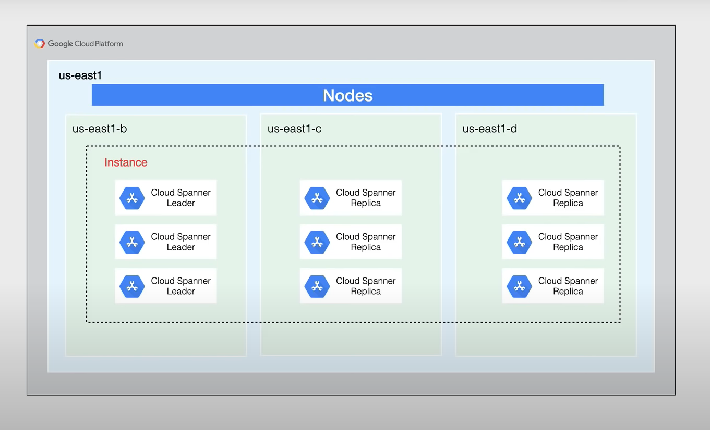

- scalable relational database
- supports ACID transactions, strong consistency, and **synchronous replication**
- google's relational database flavor
- horizontally scalable
- globally distributed
- uses [[True Time]] - a highly available atomic network clock
- handles replicas and sharding
- billing
	- $0.90/ node / hour + $0.30 a month
-
- why is it special?
	- The scalability
		- data replication is difficult, spanner does it for you
		- replicas, sharding, and transaction processing
		- cross region
	- The consistency
		- consistency and performance is usually a trade off
		- [[True Time]] is basically a Google Network global NTP
	- 99.999% availablility
		- no maintenance windows
		- synchronous replication between replicas in independant zones
		- [[Paxos]] based replication scheme, writes are only committed when
-
- 10,000 queries QPS of reads or 2,000 QPS of writes
- 2TB of storage per node
- add nodes to increase data throughput and QPS
- 
-
-
- 