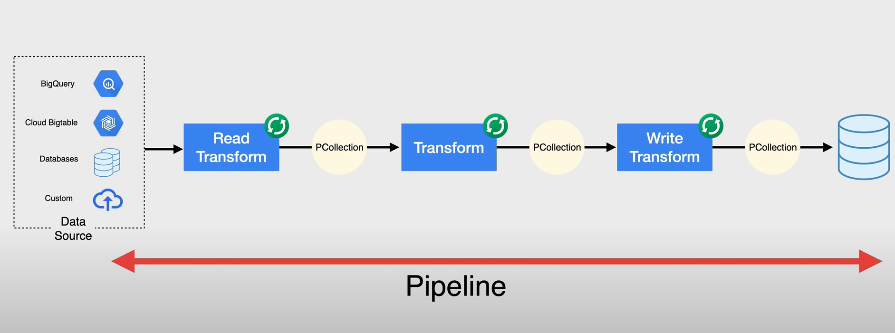

- fully managed processing service for executing [[Apache Beam]] pipelines
- Serverless
- for batch and realtime data streaming
- when to use
	- more portable across different execution environments
- basics
	- takes data from a source
	- transforms it
	- writes it back to a sink
- 
- 