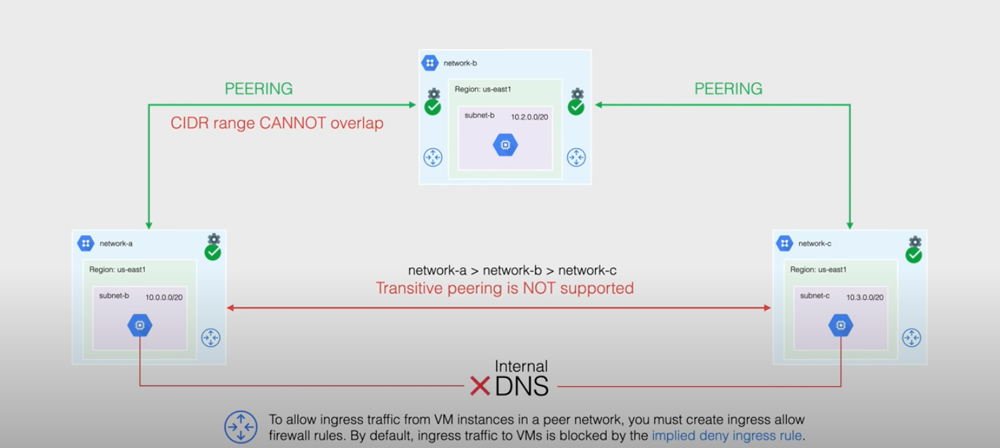

- I HAD A BLOCK HERE BUT FORGOT WHAT IT WSA ABOUT
- [[GCP VPC]]
	- Custom Mode
	- Auto Mode
	- **CAN GO FROM AUTO TO CUSTOM BUT NOT BACK**
- Subnets
	- VPCs must have at least one subnet
	- cannot change name or region of a subnet once it's created
	- Reserved IPs
		- Network address
		- Default Gateway
		- Second-to-last address - Google Cloud future use
		- Broadcast
- [[GCP VPC]] Routing
	- routes are stored in the VPC routing table
	- Routing types
		- System Generated
			- default
				- default gateway
				- path for [[Private Google Access]]
				- priority of 1000
			- subnet route
				- each subnet has at least one subnet route that matches the IP range
				- cannot delete subnet route unless you modify or delete the subnet
				- sometimes when pairing using VPC peering, it will associate a different subnet with the route, you will need to unpair before you delete the route
				- priority of 0
		- Custom Routes
			- static route
				- can use next hop features
				- static routes for [[GCP Cloud VPN]] remote traffic selectors are created for you
				- can use a load ballancer as a next hop
			- dynamic routes
				- managed by one or more [[GCP Cloud Router]]s
				- next hops are always BGP peered routers
	- special return paths are used by Google's internal network
- VPC Peering
	- private connectivity across two VPC networks
	- RFC 1918 standard
	- peer accross same or different [[GCP Project]]s and [[GCP Organization]]s
	- reduce latency
	- increase security
	- reduce egress costs
	- Subnet CIDR range in One subnet cannot overlap with a static route or subnet in another peered network
	- transitive peering is not supported
	- 
- Shared VPC
	- want to share resources across projects, but separate billing across [[GCP Project]]s
	- this is a logical separation over the [[GCP VPC]]
		- resources are all in the same VPC and project, but they are separated into logical projects so that they can each have their own permissions
	- resources are in the same VPC network
	- projects are either
		- host project
		- service project
			- attach a project to a host as a service project
			- each service can only be attached to one host
		- standalone project