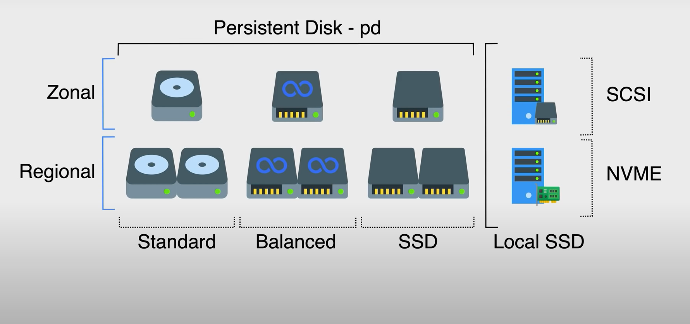

- durable block storage for instances
- raw storage
- network attached disks
	- backups
		- zonal can be backed up within the zone, but should use [[GCP Disk Snapshots]] for HA stratagy
		- regional does replication across different zones, designed to work with HA instances
			- slower than zonal disks
			- can't use with compute or memory optimized machine types
- Types of persistent disk
	- Standard
		- lowest cost
	- Balanced
	- SSD
		- Highest stats
	- see [[GCP Local SSD]] for more
- 
- can use Disk Resize to scale
- each disk can go up to 64TB each
- {:height 264, :width 256}