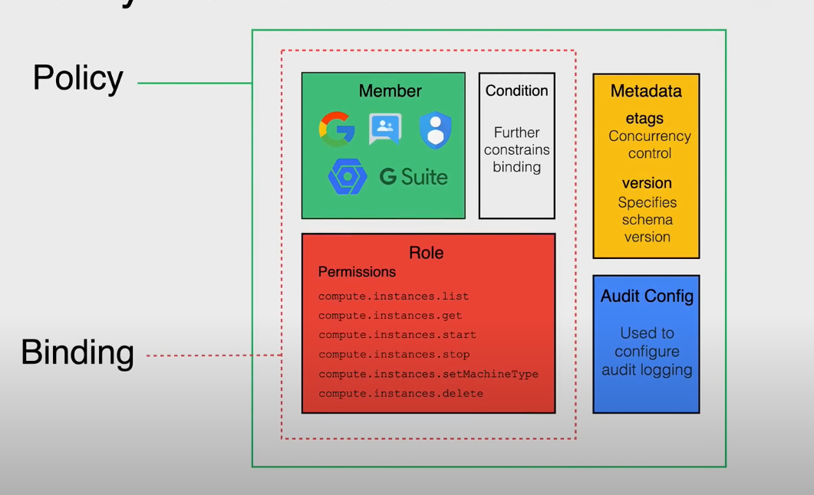

- a collection of bindings,
	- binds one or more members to a single role
	- context specific conditions for how and when the role is given
- metadata
	- more information about the policy
	- versioning
	- schema
	- etags
- and audit config
	- used to define how access attempts are logged and handled
-
- 
-
- The nitty gritty
- GCP Members can be
	- google accounts for people
	- [[GCP Service Account]]
	- [[Google Groups]] like a domain group
		- cannot establish identity but can be used for permission inheritance
	- [[G Suite Domain]] a virtual group of all of the google accounts for the
		- cannot establish identity but can be used for permission inheritance
	- [[GCP Cloud Identity]] domain like G suite, but members don't have access to G suite programs and features
	- All Identified users - a special group for all those who have an authenticated google account
	- All Users - all users on the internet, including those who are anonymous
- Permissions and [[GCP Roles]]
	- Determines what operations are allowed
	- Usually correspond one-to-one with API groups
		- service.resource.verb
	- grant roles with one or more permissions
	- Primitive Roles
		- Owner
		- Editor
		- Viewer
		- **avoid these roles if possible**
	- Predefined
		- give more granular access
		- created and maintained by Google
	- Custom
		- tailor permissions to the needs of the org
		- must choose an org or project to create it in
- [[GCP Conditions]]
	- further constrain bindings of roles and users
	- used to define and enforce conditional, attribute-based access control
	- allow you to choose granting resource access to identities only if those conditions are met
- Metadata
	- etags for concurrency control (like when kubernetes tags a resource itself)
	- in order to prevent the risk of overwriting when multiple systems try to write different systems write to the same policy
	- versioning
- [[GCP AuditConfig]]
-
- see [[GCP Policy Statement]] for an example of policy definition file
-
-