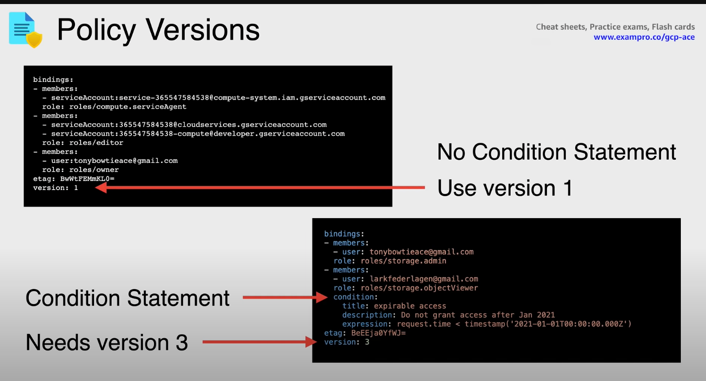

- ```
  bindings:
  - members:
    - user:mike@example.com
    - group:admins@example.com
    - domain:google.com
    - serviceAccount:my-project-id@appspot.gserviceaccount.com
    role: roles/resourcemanager.organizationAdmin
  - members:
    - user:eve@example.com
    role: roles/resourcemanager.organizationViewer
    condition:
      title: expirable access
      description: Does not grant access after Sep 2020
      expression: request.time < timestamp('2020-10-01T00:00:00.000Z')
  etag: BwWWja0YfJA=
  version: 3
  ```
-
- get policies by running
- `gcloud projects get-iam-policy <project-id>`
-
- Policy Versions:
- Version 1 policies have no conditions
- Version 2 is reserved by Google
- Version 3 includes conditions
- 
-
- Limitations
	- 1 policy per resource (includes [[GCP Organization]] [[GCP Folder]] [[GCP Project]] )
	- up to 1500 members or 250 google groups
	- takes up to 7 minutes for changes to propagate globally
- [[GCP Conditions]]
	- can only be specific services
	- primitive roles are unsupported
	- cannot be allUsers or allAuthenticatedUsers
	- 100 conditional role bindings per policy