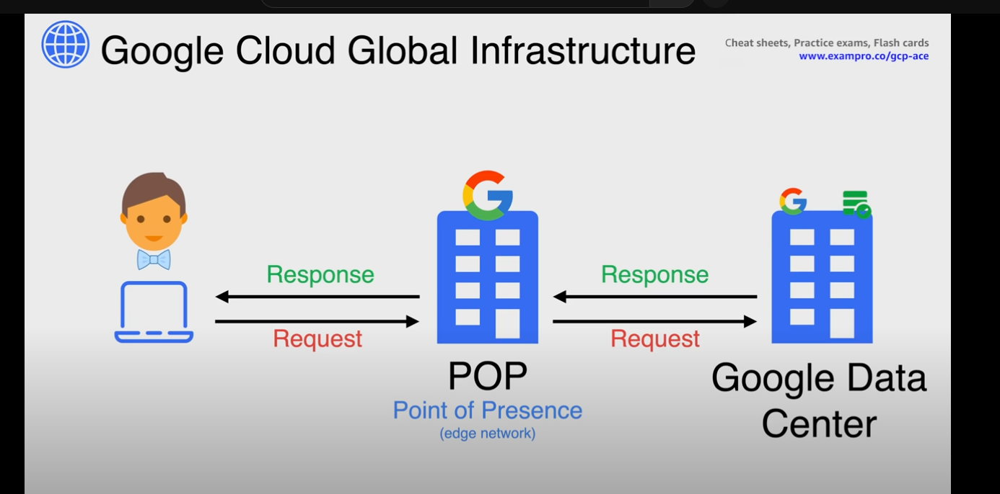

tags:: Cloud, GCP
deck:: GCP Pro Architect

- Scenario set up
	- Reliable stable connection between stores
		- current VPN is slow and has too much bandwidth eaten up by database replication
	- Fast and Cost Effective cloud backup
	- Deploy into new regions quickly when required
		- bowtie inc is a multinational company looking to expand
	- base infra is scalable and low cost
	- automated
-
- ((6387951c-793a-4180-8dda-31f508bda4b7)) #card #forward
	- On demand self service
	- Broad network access
	- Resource pooling
	- Rapid Elasticity
	- Measured Service
-
- Regions and Geographies
	- 24 [[Region]]s
	- 73 ((638a41a2-9491-4f0a-95ef-492279f64cbd))
	- uses [[GCP Edge POP]] / [[GCP Edge Node]] as ingress
	- GCP is unique in how they handle front end coms
	- 
	- [[GCP Multi Region]]
-
- Compute Services
	- [[GCP Compute Engine]] (GCP VMs)
		- manage multiple instances with [[GCP Instance Group]]
		- add or remove capacity using autoscaling
	- [[GCP GKE]]
	- [[GCP App Engine]]
	- [[GCP Cloud Functions]]
	- [[GCP Cloud Run]]
-
- Storage Services
	- [[GCP Cloud Storage]]
	- [[GCP Filestore]]
	- [[GCP Persistent Disk]]
-
- Database Services
	- SQL
		- [[GCP Cloud SQL]]
		- [[GCP Cloud Spanner]]
	- NoSQL
		- [[GCP Bigtable]]
		- [[GCP Datastore]]
		- [[GCP Firestore]]
		- [[GCP Memorystore]]
-
- Make a question about differences between Firestore and Datastore #card #reversed
	- some question here, which one does blank and then fill it in
-
- Networking Services
	- [[GCP VPC]]
	- [[GCP Firewall Rules]]
	- [[GCP Cloud Router]]
	- [[GCP Cloud Load Balancing]]
	- [[GCP Cloud DNS]]
	- [[GCP IP Addressing Options]]
	- [[GCP Flow Logs]]
	- Advanced connectivity:
	- [[GCP Cloud VPN]]
	- [[GCP Direct Interconnect]]
	- [[GCP Direct Peering]]
	- [[GCP Carrier Peering]]
-
- General [[GCP Networking]] can be found here
-
-
- Resource Hierarchy
  id:: 638b7b14-0709-448c-a97f-0ba4a44e5b5d
	- Permissions to resources inherit permissions similar to the structure of [[Azure AD]]
	- everything below the [[GCP Domain]] is considered a resource
	- Service-Level Resources
		- Compute Instances
		- [[GCP Cloud Storage]] buckets
		- [[GCP Cloud SQL]] databases
	- Account-level Resources
		- [[GCP Organization]]
		- [[GCP Folder]]
		- [[GCP Project]]
	- Above the [[GCP Organization]] is the [[GCP Domain]] (cloud level)
	- 
	- Resources are organized with a parent-child relationship
	- policies are controlled by [[GCP IAM]]
	- access control policies and configuration settings on a parent resource are inherited by the child
	- #+BEGIN_TIP
	  EACH CHILD RESOURCE CAN ONLY HAVE ONE PARENT
	  #+END_TIP
	- like [[Azure]], tags can be added to any resource or logical structure in GCP
	- mirror your resource hierarchy to your organization structure
-
- Billing
	- [[GCP Billing Account]] is at the cloud level
	- [[GCP Payments Profile]] is Google-level
	-
- Cost Management
	- [[GCP Committed Use Discounts]]
	- [[GCP Sustained Use Discounts]]
	- [[GCP Pricing Calculator]]
	- [[GCP Cloud Billing Budgets]]
	- [[GCP Capacity Reservations]]
	- [[GCP Billing Export]]
-
- Access
	- [[GCP API]]
	- [[GCP SDK and CLI]]
-
- Security
	- [[GCP IAM]]
	- [[GCP Policy Architecture]]
	- [[GCP Cloud Identity]]
	- [[GCP Service Account]]
	- [[GCP KMS]]
	-
-