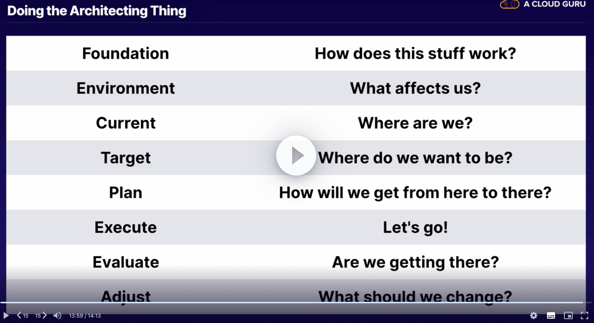

tags:: Cloud, GCP
deck:: GCP Pro Architect

- Scenerios:
- 
- 
- 
- 
-
- Exam Guide https://cloud.google.com/certification/guides/professional-cloud-architect/
-
- [[GCP Associate Engineer exam study]]
-
-
- When considering the grand plan
- 
-
- ((6387951c-793a-4180-8dda-31f508bda4b7)) #card #forward
  id:: 63a9025d-48fc-4242-8649-2aa655227faf
	- On demand self service
	- Broad network access
	- Resource pooling
	- Rapid Elasticity
	- Measured Service
-
- Regions and Geographies
	- 24 [[Region]]s
	- 73 ((638a41a2-9491-4f0a-95ef-492279f64cbd))
	- uses [[GCP Edge POP]] / [[GCP Edge Node]] as ingress
	- GCP is unique in how they handle front end coms
	- 
	- [[GCP Multi Region]]
-
- Compute Services
	- [[GCP Compute Engine]] (GCP VMs)
		- manage multiple instances with [[GCP Managed Instance Group]]
		- add or remove capacity using autoscaling
	- GCP also offers [[GCP Live Migration]] for VM instances
		- for regular maintenance, it moves the complete instance to a different zone
		- can do this manually, but GCP does this
		- GPU attached instances cannot use this feature
	- [[GCP GKE]]
	- [[GCP App Engine]]
	- [[GCP Cloud Functions]]
	- [[GCP Cloud Run]]
	- [[GCP Batch]]
-
- Storage Services
	- [[GCP Persistent Disk]] and [[GCP Local SSD]]
	- [[GCP Filestore]]
	- [[GCP Cloud Storage]]
	- Storage types refreshers
		- block storage - persistent disk
			- fastest available
			- files are split into evenly sized blocks of data with unique IDs
			- given to OS as raw data
			- OS structures it with a file system
			- mountable, bootable
		- file storage
			- Network File system
			- directory tree structure
			- Mountable (not bootable)
		- Object storage - cloud storage
			- unstructured
			- doesn't matter where it is
			- can use an open source tool to mount it called [[Fuse]]
			- but otherwise is unmountable and un-bootable
		- Performance terms
			- IO
			  :LOGBOOK:
			  CLOCK: [2022-12-09 Fri 19:32:37]
			  :END:
			- IO Queue depth
			- IOPS
			- Throughput (MBps)
			- Latency (ms)
			- Sequential access
			- random access
-
- Database Services
	- SQL
		- [[GCP Cloud SQL]]
		- [[GCP Cloud Spanner]]
	- NoSQL
		- [[GCP Bigtable]]
		- [[GCP Datastore]]
		- [[GCP Firestore]]
		- [[GCP Memorystore]]
-
- Make a question about differences between Firestore and Datastore #card #reversed
  id:: 63a9025d-62f4-4bdd-adf7-651c928744f7
	- some question here, which one does blank and then fill it in
-
- Networking Services
	- [[GCP VPC]]
	- [[GCP Firewall Rules]]
	- [[GCP Cloud Router]]
	- [[GCP Cloud Load Balancing]]
	- [[GCP Cloud DNS]]
	- [[GCP IP Addressing Options]]
	- [[GCP Flow Logs]]
	- Advanced connectivity:
	- [[GCP Cloud VPN]]
	- [[GCP Interconnect]]
	- [[GCP Direct Peering]]
	- [[GCP Carrier Peering]]
-
- General [[GCP Networking]] can be found here
-
-
- Resource Hierarchy
  id:: 638b7b14-0709-448c-a97f-0ba4a44e5b5d
	- Permissions to resources inherit permissions similar to the structure of [[Azure AD]]
	- everything below the [[GCP Domain]] is considered a resource
	- Service-Level Resources
		- Compute Instances
		- [[GCP Cloud Storage]] buckets
		- [[GCP Cloud SQL]] databases
	- Account-level Resources
		- [[GCP Organization]]
		- [[GCP Folder]]
		- [[GCP Project]]
	- Above the [[GCP Organization]] is the [[GCP Domain]] (cloud level)
	- 
	- Resources are organized with a parent-child relationship
	- policies are controlled by [[GCP IAM]]
	- access control policies and configuration settings on a parent resource are inherited by the child
	- #+BEGIN_TIP
	  EACH CHILD RESOURCE CAN ONLY HAVE ONE PARENT
	  #+END_TIP
	- like [[Azure]], tags can be added to any resource or logical structure in GCP
	- mirror your resource hierarchy to your organization structure
-
- Billing
	- [[GCP Billing Account]] is at the cloud level
	- [[GCP Payments Profile]] is Google-level
	-
- Cost Management
	- [[GCP Committed Use Discounts]]
	- [[GCP Sustained Use Discounts]]
	- [[GCP Pricing Calculator]]
	- [[GCP Cloud Billing Budgets]]
	- [[GCP Capacity Reservations]]
	- [[GCP Billing Export]]
	- billing on [[GCP Compute Engine]]
		- Resource based billing
		- bills by vCPU, memory
		- billed by second with min 1 minute
-
- Access
	- [[GCP API]]
	- [[GCP SDK and CLI]]
	- [[GCP Deployment Manager]]
	-
-
- Security
	- [[GCP IAM]]
	- [[GCP Policy Architecture]]
	- [[GCP Cloud Identity]]
	- [[GCP Service Account]]
	- [[GCP KMS]]
- Enabling security in GCP
	- Security products
	- Security features
	- Security mindset
		- *also needs an availability mindset*
		- least privilage
		- defence in depth
		- fail securely
		- and more in [OWASPs Security by Design Principles](https://wiki.owasp.org/index.php/Security_by_Design_Principles)
- To manage identity (AuthN)
	- [[G Suite Domain]], [[GCP Cloud Identity]]
	- [[GCP Service Account]]
	- identity hierarchy with [[Google Groups]]
	- [[GCDS]]
- For authorization (AuthZ)
	- [[Google Groups]]
	- resource hierarchy [[GCP Organization]], [[GCP Folder]], [[GCP Project]]
	- and [[GCP IAM]]
	- consider Billing management as well
- for accounting
	- audit/ activity logs in [[GCP Cloud Monitoring]]
	- [[GCP Billing Export]]
		- to [[GCP BigQuery]]
		- [[GCP Cloud Storage]] bucket
		- GCS Object Lifecycle management
-
- Big Data and Data Flows
	- [[GCP BigQuery]]
	- [[GCP Dataflow]]
	- [[GCP Cloud Dataproc]]
	- [[GCP Cloud Pub/Sub]]
	- [[GCP Composer]]
	- [[GCP Genomics]]
	- [[GCP Cloud Datalab]]
	- [[GCP Cloud Dataprep]]
	- important to identify and control data flows, not just memorize
	- what is a data flow
		- Moving data - network
		- Processing data - compute
		- Remembering data - storage
		- and all the messy gooey combinations between them
	- build mental models
	- identify and think through data flows
	- #+BEGIN_TIP
	  requirements and options aren't always clear, especially in the real world
	  #+END_TIP
	- In data flows, they aren't always from point a to point b
		- input is large and disparate like rainfall
		- lots of aggregation like rivers
		- lots of destinations and separation
-
- Machine Learning
	- [[GCP Vision]]
	- [[GCP Video Intelligence]]
	- [[GCP Natural Language]]
	- [[GCP Translation]]
	- [[GCP Dialogue Flow]]
	- [[GCP Speech to Text]]
	- [[GCP Text to Speech]]
	- [[GCP AutoML]]
-
- Monitoring
	- everything is contained within [[GCP Operations Suite]]
	- [[GCP Cloud Monitoring]]
	- [[GCP Cloud Logging]]
	- [[GCP Cloud Error Reporting]]
	- Application Performance Management
		- [[GCP Debugger]]
		- [[GCP Trace]]
		- [[GCP Profiler]]
	- can also use these tools with [[AWS]]
-
- Zooming in and out
	- start at the big picture
	- only get more granular when it helps you solve the problem
		- you don't need to know how packet headers are constructed to host a video streaming website
	-