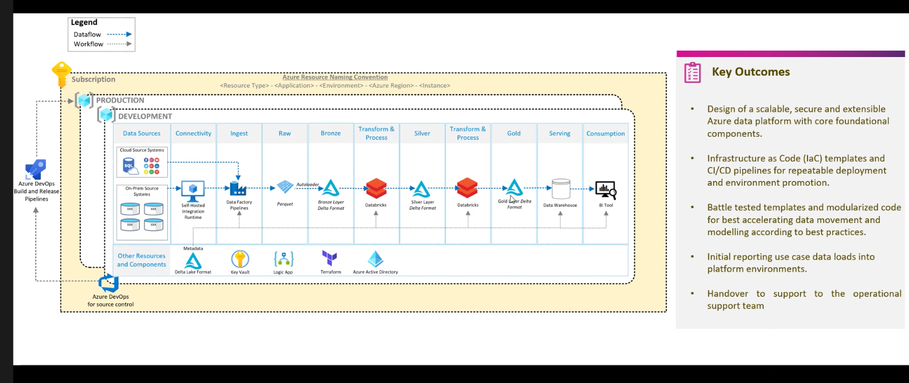

tags:: Insight

- Lens Is a complete metadata- driven Modern Data Warehouse in Azure
- Insight already has templates for
	- [[Azure Datafactory]]
	- [[Azure Databricks]]
	-
- storage classes/ types of data in the dataflow to consider
- 
- these are actually just containers in the single data lake
- all of this goes towards cleaning the data to go into PowerBI
-
- 
-
- questions
	- is each data level a different resource? or is it just another notebook
	-