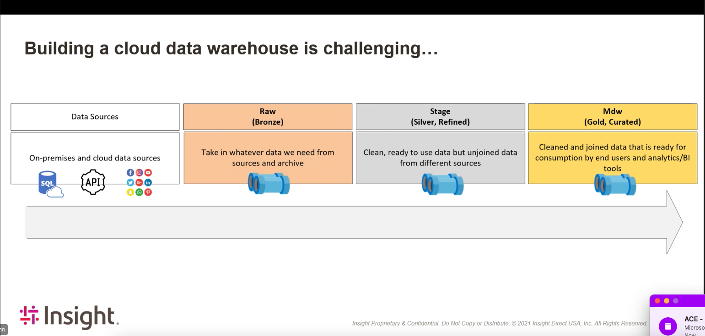
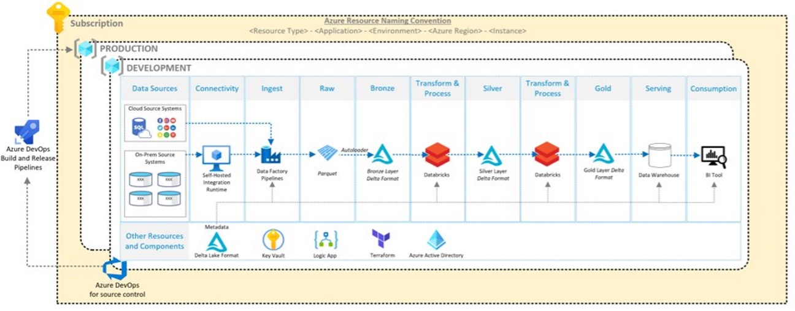

tags:: Insight

- Lens Is a complete metadata- driven Modern Data Warehouse in Azure
- Insight already has templates for
	- [[Azure Datafactory]]
	- [[Azure Databricks]]
	-
- storage classes/ types of data in the dataflow to consider
- 
- these are actually just containers in the single data lake
- all of this goes towards cleaning the data to go into PowerBI
-
- 
-
- the pipeline for the data workbooks
	- the two main artifacts in the devops pipeline is are [[Azure Databricks]] and [[Azure Datafactory]]
	- these are stored as python files in notebooks in the devops repo
	- the build pipeline zips the notebooks and and gets it ready to go to a specific environment
	- gets stored as a databricks artifact
	- then has staging and build pipelines for sending those out
		- extracts the zip and defines where
		- use secrets to access databricks env using [[Azure Key Vault]]
		- #+BEGIN_TIP
		  May need to use python 3.6 because there was a bug with earlier versions
		  #+END_TIP
	- looks like the devops project is using Databricks for Azure DevOps
	- connect to databricks using databricks access token
	- more variables needed
		- clusterid
		- notebook script
		- system debug = true
		- workspace url
	- sometimes, you want to have post deployment scripts in the workspace
		- this can be done within ADO, as long as you have the cluster ID and the specific script
-
- [[Azure Datafactory]] is the thing that goes into [[Azure Databricks]] and executes stuff
- pipeline for [[Azure Datafactory]]
	- again, lots of files and scripts and stuff that get packaged together and sent to ADO artifact registry
	- lots of powershell scripts for finding bits in JSON files and replacing them with defined variables (just sed this)
	- again variables are defined in ADO to help these access the [[Azure Datafactory]]
-
- mpp data wherehouse, synaps sql pools
	- a cluster of data warehouses
-
- The data warehouse now can function agnostically, does not need to be just a SQL
-
- in step 8, need to
- analysis services is very expensive and not serverless. We use automation services [[Azure Logic Apps]] and automation [[Azure Batch]] functions to turn it on and off
	- in lens, [[Azure Logic Apps]] refreshes analysis services data model each time the
-
- analysis services is now no longer necessary, can just host in power bi
-
-
-
- questions
	- is each data level a different resource? or is it just another notebook
		- answer: no, databricks is just one resource that accesses different parts of datafactory
-