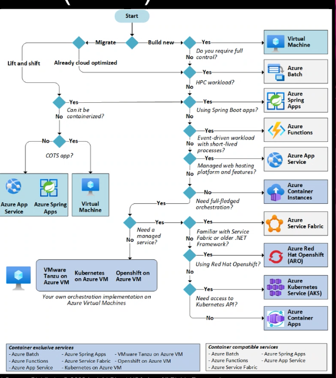

tags:: Ace, Insight, Cloud, Azure

- How do we know what the definition of "done" is?
-
- Don't design the cloud platform like a traditional infrastructure
	- used to be, IT gave you a very specific box, and you had to develop towards the infrastructure
	- you have more flexibility now
	- design for the application
	  id:: 6388c676-53e9-42fb-a8f0-6494f43093e4
-
- what kind of behavior are we using
	- how is the infrastructure maintained
	- are people just SSHing into the machine and changing one thing
	- Cattle vs Pets
-
- planning an app migration
	- assess it
		- some companies are going to have A LOT of different pipelines that need to be taken into consideration
	- ((6388c676-53e9-42fb-a8f0-6494f43093e4))
	- Tooling Up...
	- Workflows and Pipelines
	- Helpful utilities
		- [[Azure Migrate]]
		- [[Azure Movere]]
		- Solution Assessment
		- Decision Trees
		- 
		- Interviews and walkthroughs
-