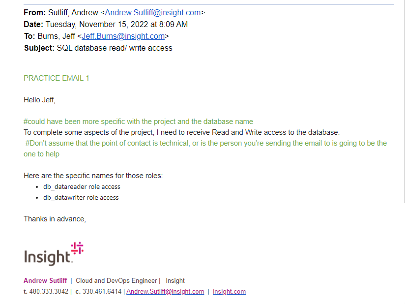

tags:: Communication, Insight, Soft Skills

- The Basics
	- need to make our words count
	- don't be ignored - the average American worker receives over 125 emails
	- keep it simple
		- avoid jargon, use simple words
		- don't repeat the message
	- keep it concise
		- get to the point
		- avoid filler - don't make them scroll
		- be direct
		- avoid word vomiting when working on something new to try to work through it
			- or, just relook through it and figure out what's the most important
	- be organized
		- what's the central message
		- need a beginning, middle, and end, maybe not in that order
		- be action focused
	- make it easy on your reader
		- use bullets when able
		- @ people
		- format breaks to make it easier to read
		- avoid mixing fonts, sizes, colors
		- be specific about needs
	- read and re-read before sending
		- review at least once
		- if the message is tense, let it cool before sending
		- watch for grammar, spelling, and format
-
- when an email won't do
	- the issue is detailed or complex
	- unresolved exchanged goes to 3
	- there is room for context misinterpretation
	- it's urgent or important
-
- writing to sales people
	- simple language is always beter
	- be specific
	- lean positive
	- "punchline, then joke"
- writing for clients
	- never use jargon, avoid acronyms
	- never assume, be clear
	- be explicit with requests
-
- 